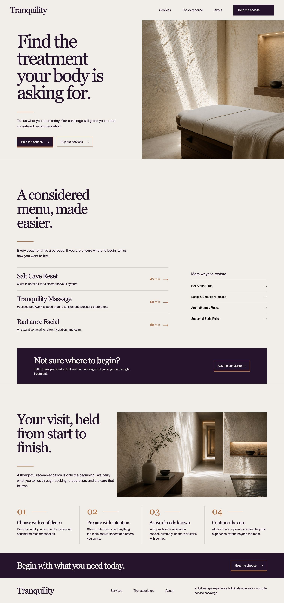

# Tranquility Spa Concierge

A working prototype showing how spas can turn service confusion into a concise recommendation, confident booking, and a useful operator summary. It is a fictional portfolio project, not a client site or a claim of a real engagement.

[View the live prototype](https://spa-concierge-prototype.pages.dev/)



## The problem

A spa menu can leave people choosing by title instead of by what they actually need. Tranquility makes the first decision simpler: describe how you want to feel, receive one considered recommendation, then book or continue the conversation.

## Product journey

1. **Start in free text** — the visitor describes what they want, then chooses a goal, duration, and experience style.
2. **Receive one concise recommendation** — Make loads the eligible Airtable services and DeepSeek chooses only from that shortlist.
3. **Book in Cal.com** — Cal.com is the booking authority and collects booking contact details.
4. **Support the visit** — Tally handles post-booking intake and feedback, while the operator receives a useful summary.

When a visitor chooses **Ask the spa**, Typebot collects their name and email so staff can follow up; it does not capture contact for booking. The live recommendation is constrained by Airtable's active services and the selected duration. DeepSeek can rank those eligible services, but it cannot invent a treatment or alter its booking URL.

This site is only the presentation layer. Live operations remain Typebot, Make, Airtable, Tally, Cal.com, and Gmail.

## Architecture

- SvelteKit 5 with TypeScript and Svelte runes.
- `@sveltejs/adapter-static` with an `index.html` fallback for Cloudflare Pages.
- One page with semantic sections, local photography, direct Cal.com booking links, and Typebot's official bubble embed.
- A typed 20-service demo catalog in `src/lib/catalog.ts` renders the public menu with category filtering. Six booking pools map services to shared Cal.com events; links are generated with duration and Cal’s built-in notes prefill. Airtable is the editable source used by the live concierge.
- No UI framework or component library.

## Guardrails

- Make filters Airtable by active status and exact duration before DeepSeek sees any candidates. A specifically named treatment is never replaced when its duration does not fit.
- Cal.com owns availability and booking; the concierge never invents an open time.
- Tally is reserved for post-booking intake and feedback. Typebot collects name and email only for an explicit Ask the spa request.
- Direct booking links remain explicit external fallbacks and open in a new tab.

## Design references

The visual direction is recorded in `design/hero-concept.png`, `design/services-concept.png`, and `design/experience-concept.png`. Production UI uses only the standalone images in `static/images/`.

## Local setup

```bash
npm install
npm run dev
```

Open `http://localhost:5173`.

## Commands

```bash
npm run check   # Svelte and TypeScript checks
npm run build   # static production build
npm run lint          # Prettier formatting check
npm run check:catalog # Catalog pools, mappings, URLs, active state, and durations
```

The recommendation, duration, booking, staff-help, and catalogue scenarios used to test the concierge are documented in [DOGFOOD.md](DOGFOOD.md). Representative catalog coverage includes one booking-pool case for each of Massage & Bodywork, Facials, Body Treatments, Salt Cave, Restorative Rituals, and Consultation. Services in the same pool share one Cal event while retaining their own duration and built-in notes prefills.

`scripts/build-typebot-production.mjs` reproduces the production-shaped Typebot canvas from an exported bot payload. It contains public identifiers and webhook destinations, never API keys.

The Typebot public ID is widget configuration, not a secret. No API keys belong in this repository. Cal.com URLs are public booking destinations.

## Cloudflare Pages

Build command: `npm run build`  
Output directory: `build`  
Node version: use the current LTS version supported by the project.

No environment variables are required for the static presentation site. Configure Typebot, DeepSeek, Make, Airtable, Tally, Cal.com, and Gmail credentials only in their respective hosted tools.

## License

MIT. See `LICENSE`.
